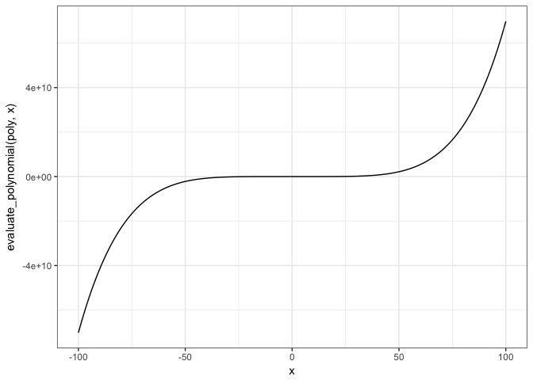

Object oriented programming
================
Marni Tausen
2016-11-29

Exercises for Object oriented programming
-----------------------------------------

### Shapes

Let us imagine that we need to handle some geometric shapes for a program These could be circles, squares, triangles, etc. Properties we need to know about the shapes are their circumference and area. These properties can be calculated from properties of the shapes, but the calculations are different for each shape.

So for our shapes, we want (at least) an interface that gives us two functions: `circumference` and `area`. The default functions, where we have no additional information about an object aside from the fact that it is a shape, are meaningless so should raise an error (check the `stop` function for this), but each specialised shape should implement these two functions.

Implement this protocol/interface and the two functions for at least circles and rectangles; by all means, more shapes if you want to.

``` r
circle <- function(radius) structure(list(radius=radius), class="circle")
square <- function(side) structure(list(side=side), class="square")
rectangle <- function(x, y) structure(list(x=x, y=y), class="rectangle")
triangle <- function(l, h) structure(list(l=l, h=h), class="triangle")

circumference <- function(x) UseMethod("circumference")
circumference.default <- function(x) cat("Not available for object type:", class(x), "\n")

circumference.circle <- function(x) 2*pi*x$radius
circumference.square <- function(x) x$side*4
circumference.rectangle<- function(x) x$x*2+x$y*2
circumference.triangle <- function(x) x$l+x$h+sqrt(x$l^2+x$h^2)

area <- function(x) UseMethod("area")
area.default <- function(x) cat("Not available for object type:", class(x), "\n")

area.circle <- function(x) x$radius^2*pi
area.square <- function(x) x$side^2
area.rectangle <- function(x) x$x*x$y
area.triangle <- function(x) x$l*x$h*0.5

cir <- circle(12)
sq <- square(12)
rec <- rectangle(12, 6)
tri <- triangle(6, 12)

circumference(cir)
```

    ## [1] 75.39822

``` r
circumference(sq)
```

    ## [1] 48

``` r
circumference(rec)
```

    ## [1] 36

``` r
circumference(tri)
```

    ## [1] 31.41641

``` r
area(cir)
```

    ## [1] 452.3893

``` r
area(sq)
```

    ## [1] 144

``` r
area(rec)
```

    ## [1] 72

``` r
area(tri)
```

    ## [1] 36

### Polynomials

Write a class that lets you represent polynomial objects. An *n*-degree polynomial is on the form *c*<sub>0</sub> + *c*<sub>1</sub> \* *x* + *c*<sub>2</sub> \* *x* \* *x* + ⋯ + *c*<sub>*n*</sub> \* *x* \* *x* \* ⋯ \* *x* and can be represented by the *n* + 1 coefficients (*c*<sub>0</sub>, *c*<sub>1</sub>, …, *c*<sub>*n*</sub>). Write the interface such that you can evaluate polynomials in any point *x*, i.e. with a function `evaluate_polynomial(poly, x)` that gives you the value of the polynomial at the point `x`.

The function `uniroot` (built into R) lets you find the roots of a general function. Use it to write a function that finds the roots of your polynomials. This function works by numerically finding the points where the polynomial is zero. For lines and quadratic polynomials, though, there are analytical solutions. Write special cases for such polynomials such that calling the root finding function on the special cases exploits that solutions are known there.

``` r
polynomial <- function(...){
    parameters <- list(...)
    polynomials <- list()
    for(i in parameters) {
        if(class(i)!="numeric") {
            stop("Stop wrong type:", class(i), " Please only use numeric!")
        }
        polynomials <- c(polynomials, as.list(i))
    }
    structure(polynomials,
              class="polynomial")
}

evaluate_polynomial <- function(poly, x) UseMethod("evaluate_polynomial")
evaluate_polynomial.default <- function(poly, x) stop("No function for this class:", class(poly))
evaluate_polynomial.polynomial <- function(poly, x){
    y <- 0
    c <- 0
    for(w in poly){
        y <- y+w*x^c
        c <- c+1
    }
    y
}

print.polynomial <- function(x) {
    c <- 0
    for(w in x){
        if(c==0) {
            cat(w)
        } else {
            cat(" + ", w, "x^", c, sep="")
        }
        c <- c+1
    }
    cat("\n")
}

(poly <- polynomial(2, 3, 5, -6, -2, 7))
```

    ## 2 + 3x^1 + 5x^2 + -6x^3 + -2x^4 + 7x^5

``` r
x <- -100:100
qplot(x, evaluate_polynomial(poly, x), geom="line") + theme_bw()
```



``` r
find_root <- function(poly, x, interval){
    uniroot(evaluate_polynomial, interval, poly=poly)
}

find_root(poly, x, c(-50, 50))
```

    ## $root
    ## [1] -1.04767
    ## 
    ## $f.root
    ## [1] -0.0001214854
    ## 
    ## $iter
    ## [1] 19
    ## 
    ## $init.it
    ## [1] NA
    ## 
    ## $estim.prec
    ## [1] 6.103516e-05
