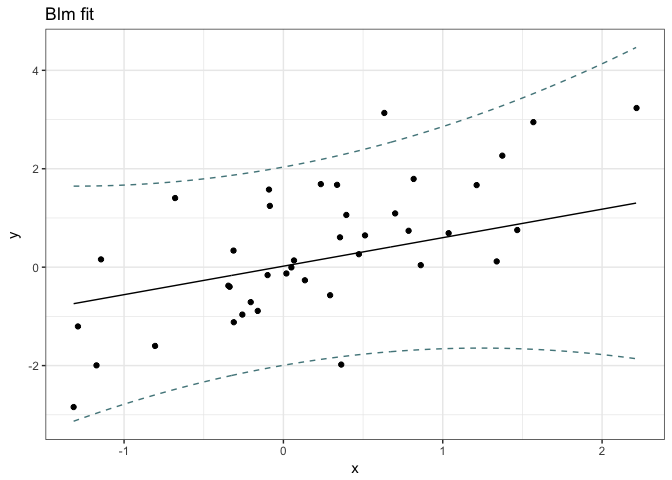

Project exercises 3
================
Marni Tausen
2016-12-07

Class project: Bayesian linear regresssion
------------------------------------------

Implement a constructor for a `blm` class. One approach, taken from the textbook, is implementing an `update` function and a `blm` function:

``` r
update <- function(model, prior, ...) { ... }
blm <- function(model, ...) {
    # some code here...
    prior <- make_a_prior_distribution_somehow()
    posterior <- update(model, prior, ...)
    # some code that returns an object here...
}
```

To get this version of `blm` to work you need to get the prior in a form you can pass along to `update` but if you did the exercises earlier you should already have a function that does this (although you might want to create a class for these distributions and return them as such so you can manipulate them through an interface if you want to take it a bit further).

``` r
make_prior <- function(model, alpha){
    n <- ncol(model.matrix(model))
    list(mu=vector("numeric", length=n), Sigma=diag(1/alpha, nrow=n))
}

update <- function(model, prior, beta, ...) {
    data <- model.frame(model)
    mx <- model.matrix(model, ...)
    Sxy <- solve(prior$Sigma + beta * t(mx) %*% mx)
    mxy <- beta * Sxy %*% t(mx) %*% data[,1]
    list(mu=mxy, Sigma=Sxy)
}


blm <- function(model, alpha, beta, ...) {

    prior <- make_prior(model, alpha)
    posterior <- update(model, prior, beta, ...)

    obj <- list(coefficients=t(posterior$mu),
                variances=posterior$Sigma,
                model=model.frame(model),
                prior=prior,
                posterior=posterior,
                terms=model,
                alpha=alpha,
                beta=beta)
    class(obj) <- "blm"
    obj
}
```

``` r
x <- rnorm(40)
y <- rnorm(40, x)
z <- x/y

fit <- blm(y ~ x + z, 1, 1)
```

### Model methods

There are some polymorphic functions that are generally provided by classes that represent fitted models. Not all models implement all of them, but the more you implement, the more existing code can manipulate your new class; another reason for providing interfaces to objects through functions only.

Below is a list of functions that I think your `blm` class should implement. The functions are listed in alphabetical order, but many of them are easier to implement by using one or more of the others. So read through the list before you start programming. If you think that one function can be implemented simpler by calling one of the others, then implement it that way.

In all cases, read the R documentation for the generic function first. You need the documentation to implement the right interface for each function anyway so you might at least read the whole thing. The description in this note is just an overview of what the functions should do.

#### coefficients

This function should return fitted parameters of the model. It is not entirely straightforward to interpret what that means with our Bayesian models where a fitted model is a distribution and not a single point parameter. We could let the function return the fitted distribution, but the way this function is typically used that would make it useless for existing code to access the fitted parameters for this model as a drop in replacement for the corresponding parameters from a `lm` model, for example. Instead, it is probably better to return the point estimates of the parameters which would be the mean of the posterior you compute when fitting.

Return the result as a numeric vector with the parameters named. That would fit what you get from `lm`.

``` r
coefficients.blm <- coef.blm <- function(x){
    n <- colnames(x$coefficients)
    coefs <- as.vector(x$coefficients)
    names(coefs) <- n
    coefs
}

coefficients(fit)
```

    ## (Intercept)           x           z 
    ##  0.13601489  1.26264238 -0.07764627

#### confint

The function `confint` gives you confidence intervals for the fitted parameters. Here we have the same issue as with `coefficients`: we infer an entire distribution and not a parameter (and in any case, our parameters do not have confidence intervals; they have a joint distribution). Nevertheless, we can compute the analogue to confidence intervals from the distribution we have inferred.

If our posterior is distributed as **w** ∼ *N*(**m**, **S**) then component *i* of the weight vector is distributed as *w*<sub>*i*</sub> ∼ *N*(*m*<sub>*i*</sub>, **S**<sub>*i*, *i*</sub>). From this, and the desired fraction of density you want, you can pull out the thresholds that match the quantiles you need.

You take the `level` parameter of the function and get the threshold quantiles by exploiting that a normal distribution is symmetric. So you want the quantiles to be `c(level/2, 1-level/2)`. From that, you can get the thresholds using the function `qnorm`.

``` r
#    parm: a specification of which parameters are to be given
#          confidence intervals, either a vector of numbers or a vector
#          of names.  If missing, all parameters are considered.
#    extra parm feature, if the parm is the response, it gives confidence
#    intervals on the data, and if new data is given, it gives confidence
#    intervals on the newly predicted data.
confint.blm <- function(object, parm, level = 0.95, ...){

    response = names(object$model)[1]

    if(level<0.5){
        a <- c(level/2, 1-level/2)
    } else {
        a <- c((1-level)/2, 1-(1-level)/2)
    }

    variables = names(coefficients(object))
    if(missing(parm)) parm = variables
    if(parm[1]==response){
        if(is.null(list(...)$data)){
            fit <- predict(object, variances=TRUE)
            list(lb=qnorm(a[1], fit$mean, fit$var),
                 ub=qnorm(a[2], fit$mean, fit$var))
        } else {
            fit <- predict(object, variances=TRUE, ...)
            list(lb=qnorm(a[1], fit$mean, fit$var),
                 ub=qnorm(a[2], fit$mean, fit$var))
        }
    } else {
        m <- matrix(0, nrow=length(parm), ncol=2)
        colnames(m) <- c(paste(a[1]*100, "%"), paste(a[2]*100, "%"))
        rownames(m) <- parm

        for(i in parm){
            m[i, 1] <- qnorm(a[1], mean=object$posterior$mu[i,1],
                             sd=sqrt(object$posterior$Sigma[i,i]))
            m[i, 2] <- qnorm(a[2], mean=object$posterior$mu[i,1],
                             sd=sqrt(object$posterior$Sigma[i,i]))
        }

        m
    }
}

confint(fit)
```

    ##                  2.5 %       97.5 %
    ## (Intercept) -0.1819017  0.453931486
    ## x            0.8647332  1.660551550
    ## z           -0.1540842 -0.001208389

``` r
confint(fit, "y")
```

    ## $lb
    ##  [1] -0.29528548 -3.55565442 -1.41968244 -1.05618512 -1.98059652
    ##  [6] -0.08446484 -0.90685304 -1.40605984 -0.47843078 -1.47086693
    ## [11]  0.54700951 -1.98856834 -3.75435211 -1.82691515 -1.29390516
    ## [16] -1.36115613 -0.28748228 -3.76967291 -2.23411800 -1.46818867
    ## [21] -2.38826042 -1.10546970 -2.21723619 -1.66638486 -2.99079131
    ## [26] -2.30684447 -1.58728651 -1.39977203 -2.05251699 -0.73001615
    ## [31] -2.40506860 -1.40520021 -3.00894655 -2.09926338 -0.98754923
    ## [36] -1.46502970 -2.75050940 -1.84059077 -2.16577053 -3.55106672
    ## 
    ## $ub
    ##  [1] 3.9423834 2.7335846 2.6082351 2.9994251 2.0484458 4.2352632 3.1722329
    ##  [8] 2.6172061 3.6999609 2.5486990 5.2153320 2.0408722 0.6298481 2.1916622
    ## [15] 2.7361320 3.3281175 3.9630936 0.6190033 1.8138750 2.5600999 1.6767669
    ## [22] 2.9452753 1.8426493 2.3577756 1.4942913 1.7492820 2.4309141 3.2728587
    ## [29] 1.9778186 3.3873718 1.6622651 2.6221105 1.1688028 1.9364588 3.0786243
    ## [36] 2.5562714 1.3811024 2.1824377 1.8752439 0.7694442

#### deviance

This function just computes the sum of squared distances from the predicted response variables to the observed. This should be easy enough to compute if you could get the squared distances, or even if you only had the distances and had to square them yourself. Perhaps there is a function that gives you that?

``` r
deviance.blm <- function(object, ...){
    object$model[,1]-fitted(object, ...)
}

deviance(fit)
```

    ##  [1]  0.442523524  0.451961828 -0.330892660  0.120905794  1.211181069
    ##  [6]  0.872028883  0.660242386  0.455305178  0.057155986  0.067850022
    ## [11]  0.353162174  1.551111877 -1.280235479 -0.045161283 -0.075443736
    ## [16] -0.988433711 -1.083285398  0.371116207 -0.753498408 -1.115929803
    ## [21] -0.042902432  2.213863240  0.524449837 -0.611810433  0.906649268
    ## [26] -0.840015679  1.266053871 -0.819719015 -0.123700488 -0.638008919
    ## [31] -0.005699217 -2.588056044 -0.680745976 -0.807583589 -0.306225376
    ## [36]  1.127223139  2.089271543 -0.298984776 -0.565172384 -0.604536133

#### fitted

This function should give you the fitted response variables. This is *not* the response variables in the data you fitted the model to, but instead the predictions that the model makes.

``` r
fitted.blm <- fitted.values.blm <- function(object, ...) predict(object)

fitted(fit)
```

    ##  [1]  1.82354895 -0.41103489  0.59427633  0.97161999  0.03392464
    ##  [6]  2.07539919  1.13268995  0.60557312  1.61076505  0.53891603
    ## [11]  2.88117077  0.02615192 -1.56225199  0.18237353  0.72111342
    ## [16]  0.98348071  1.83780565 -1.57533478 -0.21012153  0.54595560
    ## [21] -0.35574676  0.91990278 -0.18729344  0.34569539 -0.74825001
    ## [26] -0.27878122  0.42181378  0.93654335 -0.03734919  1.32867781
    ## [31] -0.37140173  0.60845513 -0.92007189 -0.08140230  1.04553755
    ## [36]  0.54562084 -0.68470348  0.17092348 -0.14526331 -1.39081125

#### plot

This function plots your model. You are pretty free to decide how you want to plot it, but I could imagine that it would be useful to see an x-y plot with a line going through it for the fit. If there are more than one predictor variable, though, I am not sure what would be a good way to visualise the fitted model. There are no explicit rules for what the `plot` function should do, except for plotting something so you can use your imagination.

``` r
plot.blm <- function(x, ...){
    if(is.null(list(...)$ggplot)) { ggplot = TRUE } else { ggplot = list(...)$ggplot }
    if(requireNamespace("ggplot2", quietly = TRUE) && ggplot==TRUE) {
        data = x$model
        variables = colnames(x$model)

        c = Inf
        regression_data = list()

        for(var in variables[-1]){
            if(c==Inf){
                min <- min(data[,var]); max = max(data[,var])
                sequence <- seq(min, max, by=0.01)
                c <- length(sequence)
                regression_data <- c(regression_data, list(sequence))
            } else {
                min <- min(data[,var]); max = max(data[,var])
                sequence <- seq(min, max, by=(max-min)/c)
                regression_data <- c(regression_data, list(sequence[1:c]))
            }
        }

        regression_data = data.frame(regression_data)
        colnames(regression_data) = variables[-1]

        prediction <- predict(x, data=regression_data)
        cfi <- confint(x, variables[1], data=regression_data)

        figure <- ggplot2::qplot(data[,2], data[,1]) + ggplot2::theme_bw()
        figure <- figure + ggplot2::labs(x=variables[2], y=variables[1], title="Blm fit")
        figure <- figure + ggplot2::geom_line(ggplot2::aes(x=regression_data[,1],
                                                           y=prediction),
                                              )
        figure <- figure + ggplot2::geom_line(ggplot2::aes(x=regression_data[,1],
                                                           y=cfi$lb),
                                              linetype=2, color="cadetblue4")
        figure <- figure + ggplot2::geom_line(ggplot2::aes(x=regression_data[,1],
                                                           y=cfi$ub),
                                              linetype=2, color="cadetblue4")
        figure
    } else {

    }
}

plot(fit)
```



#### predict

This function should make predictions based on the fitted model. Its interface is

``` r
predict(object, ...)
```

but the convention is that you give it new data in a variable `newdata`. If you do not provide new data, it instead gives you the predictions on the data used to fit the model.

``` r
predict.blm <- function(object, variances=FALSE, ...){

    mxy <- object$posterior$mu
    Sxy <- object$posterior$Sigma

    formula <- object$terms
    responseless.formula <- delete.response(terms(formula))
    frame <- model.frame(responseless.formula, ...)
    theta_x <- model.matrix(responseless.formula, frame)

    means = vector(length=nrow(theta_x))
    sds = vector(length=nrow(theta_x))
    for(i in seq_along(means)) {
        means[i] <- t(mxy) %*% theta_x[i,]
        sds[i] <- 1/object$beta + (t(theta_x[i,]) %*% Sxy %*% theta_x[i,])
    }

    if(variances==TRUE) return(list(mean=means, var=sds))

    means
}

newdata <- data.frame(x=rnorm(5), z=rnorm(5))

predict(fit, data=newdata)
```

    ## [1]  0.84111295 -0.39184246  0.06182864  0.11808776 -1.59944661

#### print

This function is what gets called if you explicitly print an object or if you just write an expression that evaluates to an object of the class in the R terminal. Typically it prints a very short description of the object.

For fitted objects, it customarily prints how the fitting function was called and perhaps what the fitted coefficients were or how good the fit was. You can check out how `lm` objects are printed to see an example.

If you want to print how the fitting function was called you need to get that from when you fit the object in the `blm` constructor. It is how the constructor was called that is of interest, after all. Inside that function, you can get the way it was called by using the function `sys.call`.

``` r
print.blm <- function(x){
    cat("blm model: "); print(x$terms)
    cat("\n")
    cat("Posterior:\n")
    print(t(x$posterior$mu)); cat("\n")
    print(x$posterior$Sigma)
}

fit
```

    ## blm model: y ~ x + z
    ## 
    ## Posterior:
    ##      (Intercept)        x           z
    ## [1,]   0.1360149 1.262642 -0.07764627
    ## 
    ##              (Intercept)            x            z
    ## (Intercept)  0.026310568 -0.006826357 -0.000637723
    ## x           -0.006826357  0.041216558 -0.002443771
    ## z           -0.000637723 -0.002443771  0.001520972

#### residuals

This function returns the residuals of the fit. That is the difference between predicted values and observed values for the response variable.

``` r
residuals.blm <- function(object, ...) (object$model[,1]-predict(object, ...))^2

residuals(fit)
```

    ##  [1] 1.958271e-01 2.042695e-01 1.094900e-01 1.461821e-02 1.466960e+00
    ##  [6] 7.604344e-01 4.359200e-01 2.073028e-01 3.266807e-03 4.603625e-03
    ## [11] 1.247235e-01 2.405948e+00 1.639003e+00 2.039541e-03 5.691757e-03
    ## [16] 9.770012e-01 1.173507e+00 1.377272e-01 5.677599e-01 1.245299e+00
    ## [21] 1.840619e-03 4.901190e+00 2.750476e-01 3.743120e-01 8.220129e-01
    ## [26] 7.056263e-01 1.602892e+00 6.719393e-01 1.530181e-02 4.070554e-01
    ## [31] 3.248107e-05 6.698034e+00 4.634151e-01 6.521913e-01 9.377398e-02
    ## [36] 1.270632e+00 4.365056e+00 8.939190e-02 3.194198e-01 3.654639e-01

#### summary

This function is usually used as a longer version of print. It gives you more information about the fitted model.

It does more than this, however. It returns an object with summary information. What that actually means is up to the model implementation so do what you like here.

``` r
# YOUR IMPLEMENTATION
```
